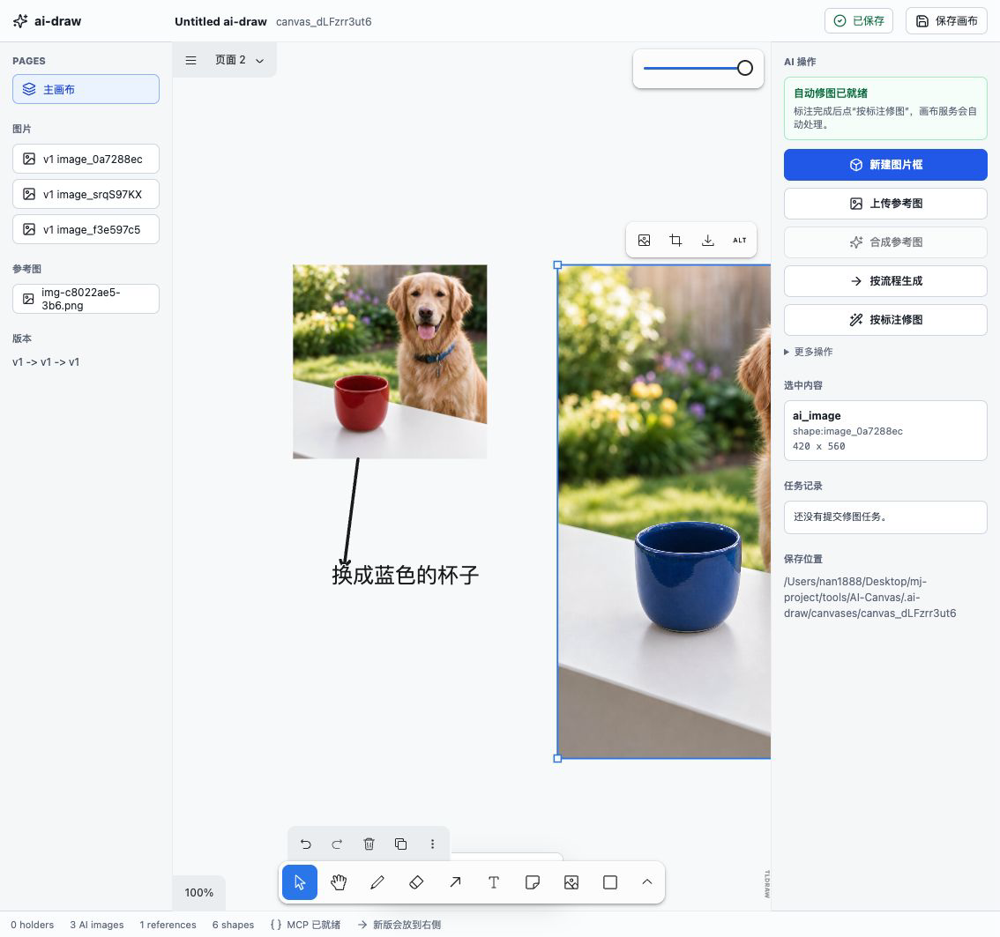
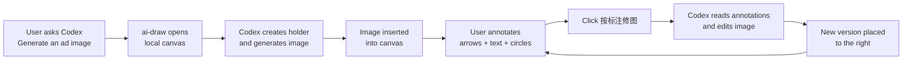

<div align="center">

# ai-draw

### An AI infinite canvas for Codex: generate images, annotate visually, and create revised versions.

[](./LICENSE)
[](#install)
[](./ai-draw/.mcp.json)
[](./ai-draw/package.json)
[](./ai-draw/package.json)
[](./README.md)
[](./README.en.md)

[中文](./README.md) · **English**

[Install](#install) · [Interface Preview](#interface-preview) · [Workflow](#workflow) · [Use Cases](#use-cases) · [Docs](#docs) · [Privacy](#privacy)

</div>

---

## What Is ai-draw?

ai-draw is a Codex plugin marketplace that adds a local infinite canvas for image generation, visual annotation, and iterative image editing.

Think of it as:

```text
An AI drawing whiteboard inside Codex.
```

Users do not need to understand MCP tools, holder IDs, run metadata, or local file paths. Ask for an image, open the canvas, annotate changes, and click the edit button.

## Interface Preview

<div align="center">
  
</div>

## Highlights

| Capability | What It Does |
| --- | --- |
| Natural prompt to image | Ask Codex for an ad, cover, poster, product image, or visual concept. |
| Local infinite canvas | Open a local tldraw-based canvas for annotation and side-by-side version comparison. |
| Visual annotation editing | Arrows, text, circles, and rectangles become edit instructions. |
| Versioned iteration | New edited images are placed to the right; originals stay unchanged. |
| Codex plugin workflow | MCP tools and Codex skills are bundled so users can work in natural language. |

## Install

### Install Into Codex App

1. Make sure Codex app is installed and the `codex` command is available in your terminal.
2. Run these commands to add the ai-draw marketplace to Codex app and install the plugin:

```bash
codex plugin marketplace add https://github.com/nan1888/ai-draw --ref main
codex plugin add ai-draw@ai-draw
```

3. Restart Codex app, or open a new chat in Codex app.
4. In the new chat, try:

```text
@ai-draw 打开 AI 画布，帮我做一张拉面广告。
```

If Codex returns a local canvas link, the plugin is installed correctly. The command still uses `ai-draw@ai-draw` because that is the current plugin install identifier; the user-facing project name is `ai-draw`.

If you need a third-party image API, open `更多操作` -> `图片接口设置` in the canvas and use [happyhorse.pics](https://happyhorse.pics/): Base URL `https://happyhorse.pics/v1`, models `gpt-image-2`, `banana2`, `gemini-3.0-pro-image`, and sizes `1k`, `2k`, `4k`.

### Local Development Install

Use this flow when you are developing from a local source checkout:

```bash
git clone https://github.com/nan1888/ai-draw.git
cd ai-draw/ai-draw
npm run setup
cd ..
codex plugin marketplace add .
codex plugin add ai-draw@ai-draw
```

Full installation, update, and troubleshooting guide:

- [INSTALL.md](./ai-draw/INSTALL.md)

## Workflow



Daily use in one minute:

1. Tell Codex what image you want.
2. Open the returned local canvas link.
3. Mark changes on the image with arrows, text, circles, or rectangles.
4. Say `@ai-draw 开启自动修图模式`.
5. Click `按标注修图` on the canvas after each batch of annotations.
6. Compare the original and new version side by side, then keep iterating.

## Example Prompts

```text
@ai-draw 打开 AI 画布，帮我做一张小红书封面。

@ai-draw 生成一张竖版拉面广告，品牌叫拉面一番，要高级食物摄影风格。

@ai-draw 开启自动修图模式。

@ai-draw 按我画布上的标注修改。
```

## Use Cases

| Scenario | What ai-draw Helps With |
| --- | --- |
| Social covers | Xiaohongshu covers, short-video covers, campaign posters |
| Ads and banners | Food ads, product ads, campaign banners, hero visuals |
| Product concepts | Moodboards, packaging directions, visual drafts, hero images |
| Iterative editing | Mark one region, generate a new version, keep the old image for comparison |
| Design review | Use the canvas as a visual discussion surface inside Codex |

## Docs

- [Plugin README](./ai-draw/README.md)
- [Installation Guide](./ai-draw/INSTALL.md)
- [Chinese User Guide](./ai-draw/使用说明.md)
- [Natural-Language Workflow](./ai-draw/自然语言工作流.md)
- [中文 README](./README.md)

## Repository Layout

```text
.agents/plugins/marketplace.json
ai-draw/
  .codex-plugin/plugin.json
  .mcp.json
  skills/
  packages/
    canvas-app/
    mcp-server/
    shared/
```

Codex reads `.agents/plugins/marketplace.json` from this repository root. The marketplace points to `./ai-draw`.

## Privacy

- The canvas service runs locally on `127.0.0.1`, default port `43218`.
--draw state and generated assets are stored locally under `.ai-draw/` in the active workspace unless `AI_DRAW_HOME` is set.
- Local runtime data, temporary QA data, dependency folders, logs, and environment files are ignored by Git.
- The plugin does not include a hosted backend. It is a local Codex plugin workflow.

## Development

```bash
cd ai-draw
npm run setup
npm run typecheck
npm run test
npm run validate:plugin
```

Manual preview:

```bash
NODE_ENV=production node packages/canvas-app/dist/server/server.js \
  --port 43218 \
  --workspace-root "<your workspace>"
```

Open:

```text
http://127.0.0.1:43218/
```

## License

MIT. See [LICENSE](./LICENSE).
